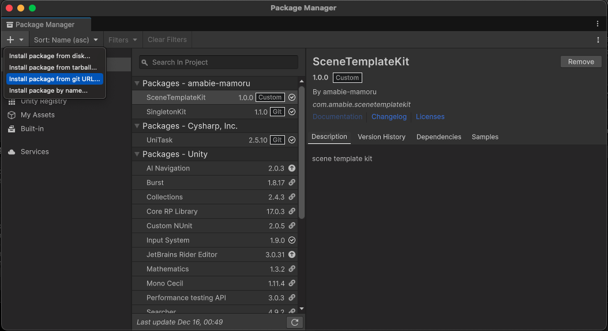
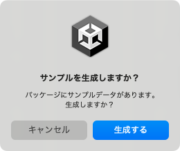

# scene template kit

Scene template kit for unity

# Get started

First, [Window] -> [Package Manager] on Unity Editor menu bar.

Second, Click [+] button and select [Add package from git URL...]



And finally, copy following url and paste in package manager text box.

```
git@github.com:amabie-mamoru/scene-template-kit.git
```

Let's enjoy 🧜

# Sample

Push [生成する] button in dialog.


